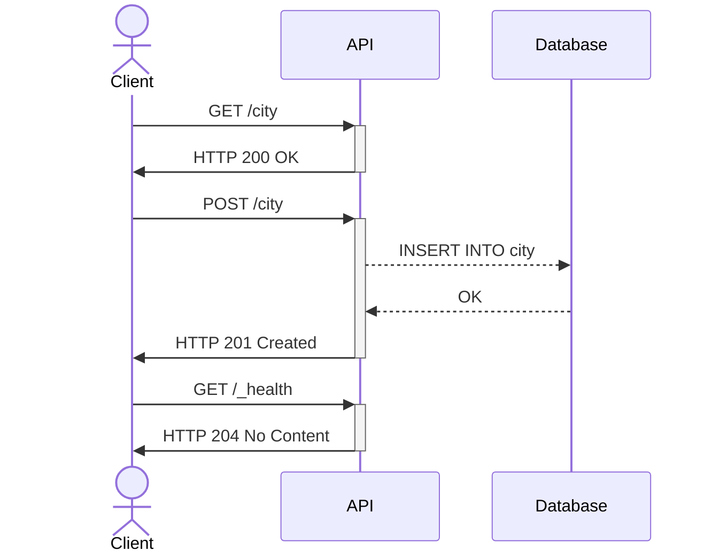

# TP-CI-CD

## Information générales

Group:
- Adrien Raimbault
- Dziyana Tsetserava
- Muriel Paraire


Langage de programmation choisie:
- Python


## Questions

### 1. Créez un fichier docker-compose.yml et ajoutez-y un service db s'appuyant sur l'imageDocker postrges:latest.

Nous avons donc crée un service de nom db de manière suivante :
```yml
services:
  db:
    # utiliser la dernière image postgres
    image: postgres:latest
    # redemarrer en cas d'échec ou de crash
    restart: always
    # prise en compte des valeurs précisé par l'utilisateur
    environment:
      - POSTGRES_PASSWORD=${CITY_API_DB_PWD:?error}
      - POSTGRES_USER=${CITY_API_DB_USER?:error}
      - POSTGRES_DB=city_api
    # le port sur lequel on peut joindre la base de données
    expose:
      - ${CITY_API_DB_PORT:?error}
    volumes:
      # l'endroit de sauvegarde
      - /var/lib/postgres
      # le script pour créer la table city
      - ./db/init.sql:/docker-entrypoint-initdb.d/create_city.sql
      # le script pour insérer les données
      - ./db/populate.sql:/docker-entrypoint-initdb.d/populate_city.sql
```

Par la suite, nous avons aussi completé notre fichier docker-compose.yml pour y ajouter un containeur démarrons notre API : 

```yml
  python:
    # le dockerfile pour lancer l'application
    build:
      context: .
      dockerfile: python.dockerfile
    # le fichier d'environnement
    env_file:
      - .env
    # l'api a besoin que la base de données sois créer pour pouvoir l'utiliser
    depends_on:
      - db
    # le port de l'application défini par l'utilisateur
    ports:
      - ${CITY_API_PORT:?error}:${CITY_API_PORT:?error}
```

### 2. Créez une base de données  city_api  avec une table  city  contenant les colonnes suivantes :
- **id** , un entier non signé non nul, clé primaire de la colonne ;
- ***department_code** , une chaîne de caractères non nulle ;
- **insee_code** , une chaîne de caractères ;
- **zip_code** , une chaîne de caractères ;
- **name** , une chaîne de caractères non nulle ;
- **lat** , un flottant non nul ;
- **lon** , un flottant non nul.

Pour créer cette table, nous avons opté de créer un script *init.sql* que nous passerons à docker lors de l'initialisation du conteneur. 

Il s'éxécuteras et créeras la table dans la base de données qui seras populé par le script *populate.sql*.

### 3. Dans le langage de votre choix, créez un service web ayant les spécifications suivantes :
  - `POST /city` avec pour corps de la requête un JSON au format décrit plus bas doit retourner un code `201` et enregistrer la ville dans la base de données ;
  - `GET /city` doit retourner un code `200` avec la liste des villes au format JSON ;
  - `GET /_health` doit retourner un code `204`.

Pour cette API, nous avons choisi d'utiliser [Flask](https://flask.palletsprojects.com/en/2.3.x/), un framework web Python qui permet de démarrer rapidement une application web; le but de ce projet n'étant pas de passer du temps sur l'application mais sur la partie CI/CD.

Le code de l'application se trouve dans le fichier [application.py](app/application.py).

Voici un diagramme de séquence pour résumer les routes :




### 4. Écrivez les tests suivants :
  - un test qui s'assure que l'insertion dans la base de données fonctionne correctement ;
  - un test qui s'assure que la récupération de la liste des villes fonctionne correctement ;
  - un test qui s'assure que l'endpoint de healthcheck fonctionne correctement.

Concernant les tests, nous avons décidé d'utiliser [Pytest](https://docs.pytest.org/en/7.4.x/).

Pytest nous permet d'utiliser la commande : 

```bash
python3 -m pytest -c app/tests/pytest.ini
```

Cette commande va trouver toutes les fonctions commençant par *test_* et va essayer de les exécuter.

PS : le fichier [pytest.ini](app/tests/pytest.ini) donne à pytest la configuration nécessaire. Comme nous utilisons une autre base de données pour les tests (cf. question 7), le fichier *pytest.init* permet de modifier les variables d'environnement et se connecter ainsi vers la base de données de tests sur un autre port que la base de données de production.


### 5. Écrivez un fichier Dockerfile à la racine de votre projet. Testez que votre image Docker est correcte.

Voici le fichier [python.dockerfile](./python.dockerfile) qui récupère l'image python, installe les dépendances d'après le fichier [requirement.txt](./requirements.txt), copie les fichiers présents dans le dossier *./app* et run l'application.

```yml
FROM python:3.10-alpine

COPY ./requirements.txt /app/requirements.txt

# set workdir to app
WORKDIR /app

# install dependencies
RUN pip install -r requirements.txt

# Copy app folder
COPY ./app /app

# configure the container to run in an executed manner
ENTRYPOINT [ "python" ]

CMD ["application.py" ]
```

PS : Nous utilisons ici une image **python:3.10-alpine** pour diminuer la taille de l'image, les images basés sur alpine étants générallement plus légères.

### 6. Écrivez un workflow GitHub Actions ci pour qu'un linter soit exécuté à chaque push.

Pour écrire notre premier workflow, nous nous sommes renseignés sur le fonctionnement de Github concernant l'intégration continue. Après quelques recherches, nous avons mis en place un runner hébergé sur l'un de nos serveurs à Polytech. C'est très simple à mettre à démarrer et cela évite d'avoir d'être limité en temps pendant le fonctionnement de la CI.

Ensuite nous avons ajouté une action permettant de récupérer l'état actuel du projet.

Enfin avant de lancer le linter, nous installons les dépendances pour éviter que Pylint remonte des erreurs liés à cela.

Le fichier [lint_and_test_ci.yml](.github/workflows/lint_and_test_ci.yml) (anciennement *github_ci.yml*) permet de réaliser toutes ces étapes et d'éxecuter [pylint](https://pypi.org/project/pylint/) qui failera si le score est inférieur à 5/10.

```yml
name: GitHub Actions CI
run-name: ${{ github.actor }} is testing out GitHub Actions 🚀
on: [push]

jobs:
  python-ci:
    runs-on: self-hosted
    steps:
          - uses: actions/checkout@v3

          - name: Install dependencies
            run: |
              python3 -m pip install --upgrade pip
              pip3 install pytest
              pip3 install pylint
              if [ -f requirements.txt ]; then pip install -r requirements.txt; fi

          - name: Analysing the code with pylint
                  run: |
                    pylint --fail-under=5 app/*
```

### 7. Modifiez le workflow pour que les tests s'exécutent à chaque push.

#### Solution N°1

Ici les tests ont déjà été écrits. Il ne reste plus qu'à les inclure dans le workflow.

La première idée que nous avons eu était de créer un duplicat de notre base de données postgres (nommée "postgres-test") qui serait lancé avec la commande

```bash
docker compose up postgres-test
```

Lors des tests nous avons eu des problèmes pour connecter la base de données et l'application. L'application se lançait après la base de données mais pas assez tard pour que la base de données puisse accepter la connexion.

#### Solution N°2

Après renseignement, nous avons découvert les [services](https://docs.github.com/en/actions/using-containerized-services/about-service-containers). Ils permettent de lancer des conteneurs docker et sont gérés par le workflow. Ils sont très configurables et permettent de préparer le "terrain" avant de lancer le workflow.

Après implémentation de cette idée, voici notre workflow (fichier [lint_and_test_ci.yml](.github/workflows/lint_and_test_ci.yml)) : 

```yml
name: GitHub Actions CI
run-name: ${{ github.actor }} is testing out GitHub Actions 🚀
on: [push]

jobs:
  python-ci:
    runs-on: self-hosted
    # Service containers to run with `container-job`
    services:
      postgres-test:
        image: postgres
        # Provide the env for postgres
        env:
          POSTGRES_PASSWORD: test
          POSTGRES_USER: test
          POSTGRES_HOST: localhost
          POSTGRES_PORT: 5436
          POSTGRES_DB: city_api
        # Set health checks to wait until postgres has started
        options: >-
          --health-cmd pg_isready
          --health-interval 10s
          --health-timeout 5s
          --health-retries 5
        ports:
          # Maps tcp port 5432 on service container to port 5436 on the host
          - 5436:5432

    steps:
      - uses: actions/checkout@v3

      - name: Install dependencies
        run: |
          python3 -m pip install --upgrade pip
          pip3 install pytest
          pip3 install pylint
          if [ -f requirements.txt ]; then pip install -r requirements.txt; fi

      - name: Analysing the code with pylint
        run: |
          pylint --fail-under=5 app/*
      
      - name: Testing code
        run: |
          psql -U test city_api -h localhost -p 5436 -f db/init.sql
          python3 -m pytest -c app/tests/pytest.ini
        env:
          PGPASSWORD: test

      - run: echo "🍏 This job's status is ${{ job.status }}."
```

### 8. Modifiez le workflow pour qu'un build de l'image Docker soit réalisé à chaque push.

N'ayant pas d'idée pour build l'image, nous avons fait des recherches et sommes tombés sur le marketplace de Github.

Le market place offre des actions préfabriquées pour simplifier le travail d'intégration continue avec Github. Nous avons décidés d'utiliser une action officielle de docker : `docker/build-push-action@v4`.
Cette action permet de build l'image docker et de la push sur le registry desirée, ce qui nous permet de réaliser la question 8 & 9 en même temps.

Voici le job dédié au build et au push :

```yml
name: GitHub Release CI
run-name: ${{ github.actor }} is testing out GitHub Actions 🚀

on: [push]

env:
  REGISTRY: ghcr.io
  IMAGE_NAME: ${{ github.repository_owner }}/city-api

jobs:
  build:
    name: Build Docker image
    runs-on: self-hosted
    permissions:
      packages: write
    steps:
      - uses: actions/checkout@v3
        name: Check out the repository

      - uses: docker/login-action@v2
        name: Log in to the container registry
        with:
          registry: ${{ env.REGISTRY }}
          username: ${{ github.actor }}
          password: ${{ secrets.GITHUB_TOKEN }}

      - uses: docker/build-push-action@v4
        name: Build and push the Docker image
        with:
          file: python.dockerfile
          push: true
```

#### Remarques :
  - On spécifie dans les variables d'environnement la registry utilisée pour push l'image (ghcr.io ici).
  - Il est nécessaire de se connecter en amont via l'action `docker/login-action@v2`. Cette action crée un token d'authentification `GITHUB_TOKEN` (ou utilise celui existant le cas echéant) pour se connecter à la registry de Github.

### 9. Modifiez le workflow pour que l'image Docker soit push sur ghcr.io avec pour tag city-api:latest.

Nous avons précédemment build & push l'image docker. Pour rajouter un tag nous pouvons simplement le préciser avec l'argument `tags` :

```yml
- uses: docker/build-push-action@v4
        name: Build and push the Docker image
        with:
          file: python.dockerfile
          push: true
          tags: [latest]
```

### 10. Écrivez un workflow GitHub Actions release qui, lorsqu'un tag au format vX.X.X soit poussé build et push l'image Docker avec un tag city-api:X.X.X.

On veut maintenant pouvoir passer un tag *version*. Le but est que si le commit ne contient pas de tag au format *vX.X.X*, l'image n'est ni build ni push.
Pour cela, il suffit juste de modifier le déclancheur (trigger) pour le lancer seulement un un tag au format *vX.X.X* est présent :

```yml
on:
  push:
    tags:
      - 'v*.*.*'
```

Ensuite il faut donner le même tag à l'image push sur la registry Github. 
On utilise ici une autre action officielle docker : `docker/metadata-action@v4`. Elle permet d'extraire les tags d'un commit.

Il suffit de rajouter un bloc dans notre fichier :

```yml
- uses: docker/metadata-action@v4
        name: Extract metadata (tags, labels) for Docker
        id: meta
        with:
          images: ${{ env.REGISTRY }}/${{ env.IMAGE_NAME }}
          tags: |
            type=semver,pattern={{version}}
            latest
```

Enfin on modifie la ligne *tags* pour ajouter à l'image les même tags :


```yml
- uses: docker/build-push-action@v4
      name: Build and push the Docker image
      with:
        file: python.dockerfile
        push: true
        tags: ${{ steps.meta.outputs.tags }}
```

### 11) Installez Minikube sur votre machine local.

Pour installer minikube on peut suivre la documentation à [https://minikube.sigs.k8s.io/docs/start/](https://minikube.sigs.k8s.io/docs/start/)

```sh
curl -LO https://storage.googleapis.com/minikube/releases/latest/minikube-linux-amd64
sudo install minikube-linux-amd64 /usr/local/bin/minikube
```
Pour lancer minikube il suffit d'utiliser la commande 
```sh
minikube start
```

### 12) Écrivez un chart Helm de déploiement de l'application.

#### Install helm :

Official documentation : https://helm.sh/docs/intro/install/


Use the chart helm : 
```
helm install <name> <path_to_helm_directory>
```

Stop it :
```
helm uninstall <name>
```

At the moment, the API is accessible from outside the Cluster, however if you wish to change that you can simply change the type of service to ClusterIP.
```yaml
service:
  type: NodePort # change to ClusterIP to block access from outside the Clutser
```

The username and password for the database are set in the city-api/values.yaml file, you are free to change them.


### 13) Déployez votre application dans votre Minikube.


To deploy the chart helm, simply run
```
helm install city-api ./city-api
```

14) Ajouter un endpoint `/metrics` compatible Prometheus (des [libs](https://sysdig.com/blog/prometheus-metrics/) sont disponibles).

15) Ajoutez un Prometheus dans votre docker-compose qui scrappe les métriques de votre application.

16) Ajoutez un Grafana dans votre docker-compose et créez y un dahsboard pour monitorer votre application
